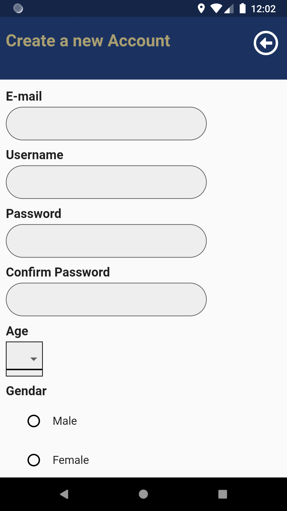
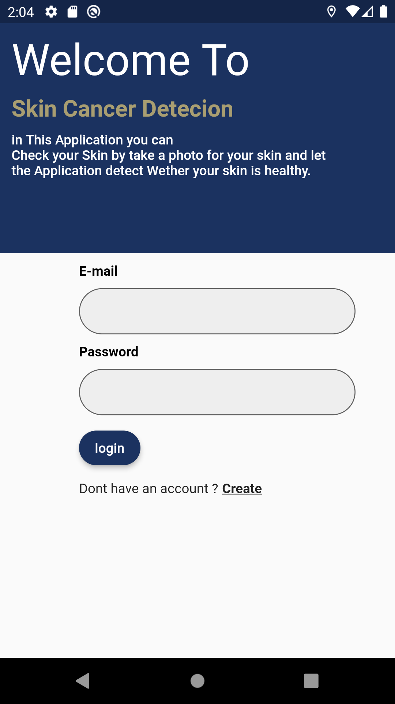
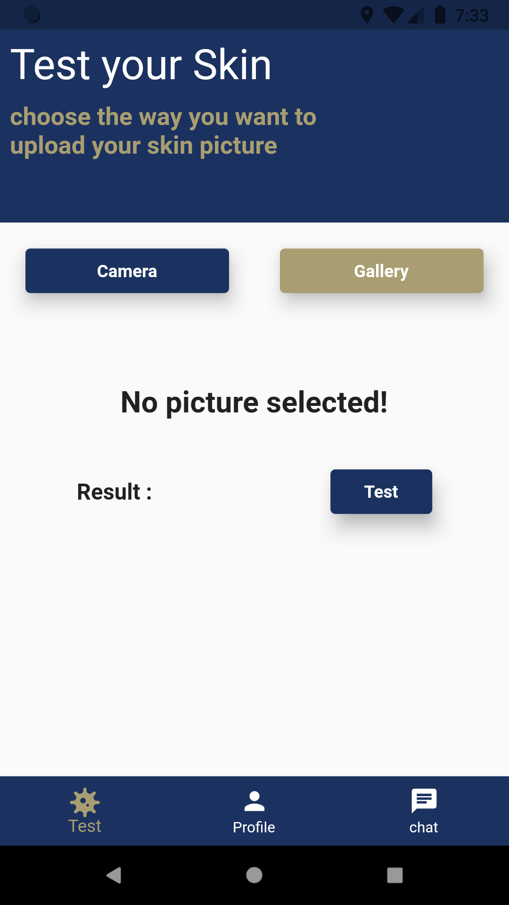
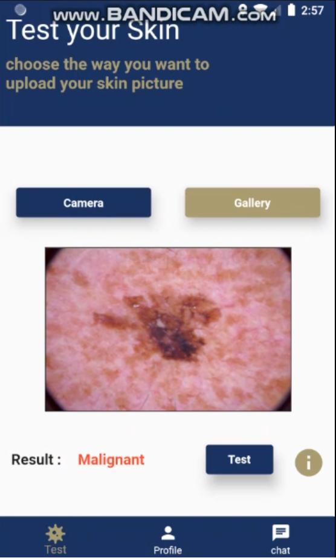
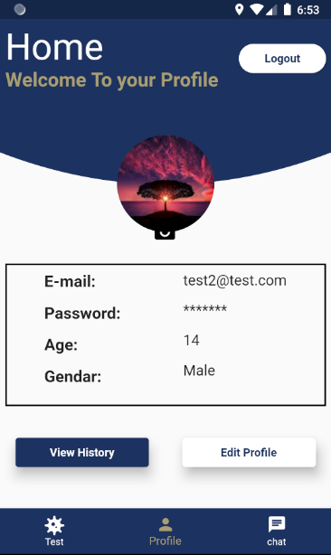
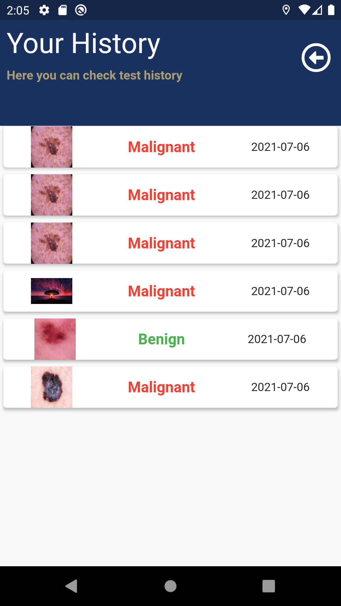
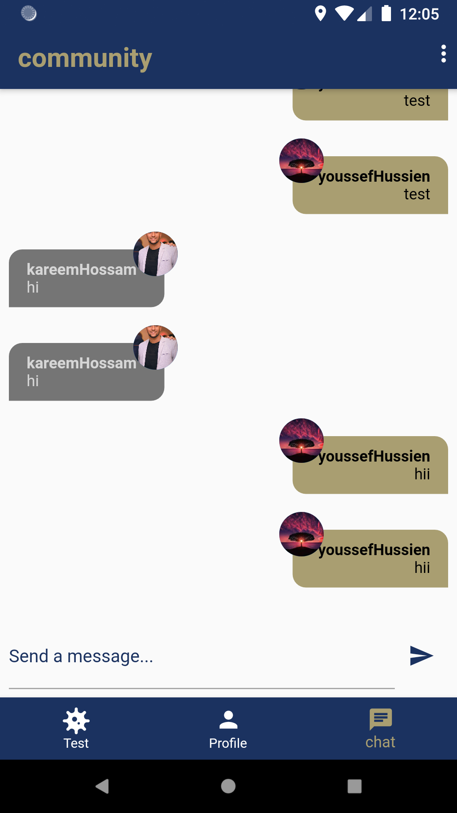

# Maligant_SkinCancer_Flutter_With_CNN Model_application

Application for detect whether the skin is Malignant or Benign.

# Technologies

- Flutter to make Cross-platform application for all users ( ios - android )
- Firebase to Save data and database online and for communcate
- Flask to Connect the Cnn Model with flutter
- Deep Learning (Cnn Model) becuase CNN is the best solution to use it in Images to can extract the Features.

# Properties of Application

- Login & registration System
- Test Skin
- View History of testing
- chat with other Patients to help each other
- chat with doctor (Future Work)

# Screenshots

 

 

